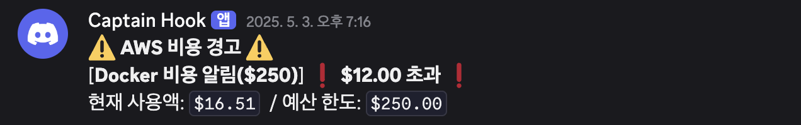

# 디스코드 AWS 비용 상세내역 알림 봇

## 1. 비용 상세내역 알림
> **매일 오전 09:00~09:15**, 현재까지의 AWS 사용 요금을 Discord로 전송합니다.

📁 [`today-billing-alert-with-discord/`](https://github.com/DDongu/discord-AWS-billing-notification-bot/tree/main/today-billing-alert-with-discord)  
📷 **예시 화면:**

---

## 2. 예산 초과 알림  
> **사전에 설정한 예산을 초과할 경우**, 실시간으로 Discord에 알림을 보냅니다.

📁 [`maximum-billing-alert-with-discord/`](https://github.com/DDongu/discord-AWS-billing-notification-bot/tree/main/maximum-billing-alert-with-discord)  
📷 **예시 화면:**

---

## 📬 문의

문제가 있거나 개선 요청이 있다면 언제든지 [Issues](https://github.com/DDongu/discord-AWS-billing-notification-bot/issues)로 알려주세요!