# 디스코드 봇 AWS 예산초과 알림

### 📌 주요기능 

✅ 예산초과 알림

: 예산에서 설정한 금액이 초과될 때마다 자동으로 알림을 보내줍니다.

---

## 준비

#### 1. 디스코드 채널에서 웹훅을 만들어 URL을 복사합니다.

#### 2. 복사한 URL을 `lambda_function.py` 파일 내의 `DISCORD_WEBHOOK_URL = "디스코드_웹훅_URL"` 값에 붙여넣습니다.

## 사용방법
### 1. Lambda 함수 생성
사진을 참고해 `Lambda > 함수`를 생성합니다.

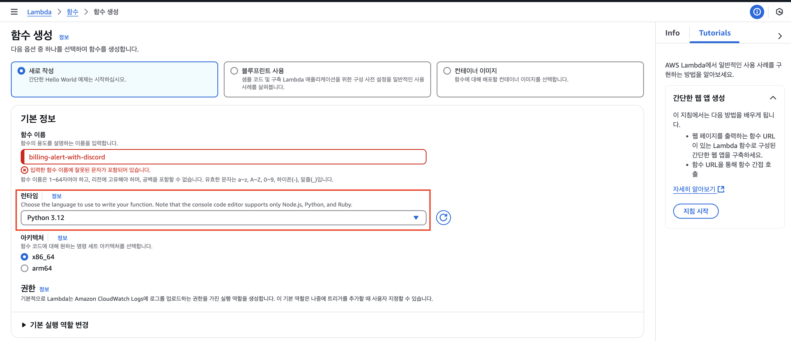
-> `함수 이름`:  billing-alert-with-discord 
-> `런타임`: Python 3.12 
=> 나머지는 Default로 두고 생성합니다. 

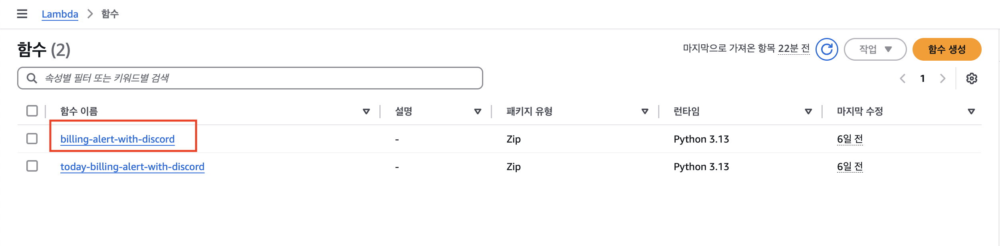
-> 생성이 완료되면 만든 함수를 클릭합니다.

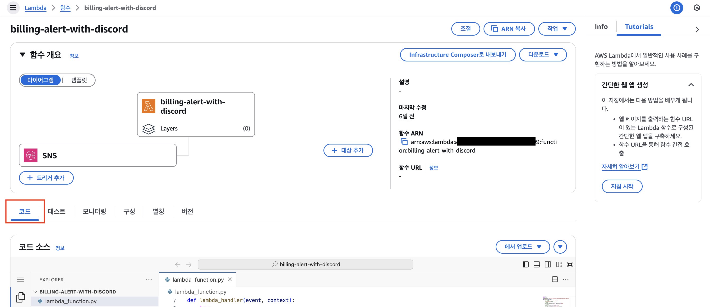
-> 해당 화면을 확인하고, 코드 탭을 선택합니다.

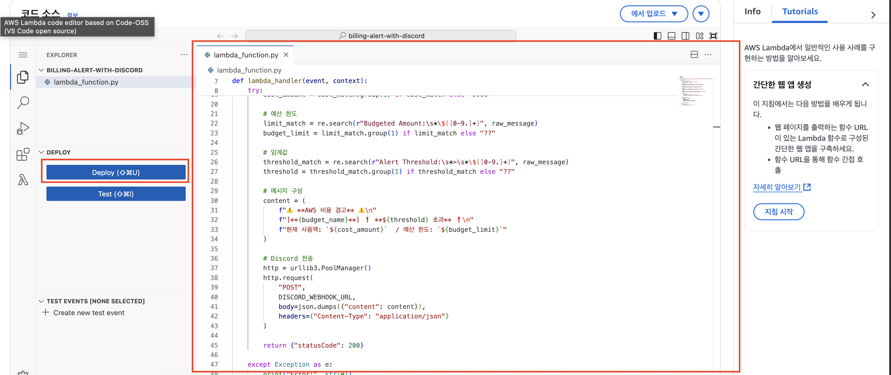
-> `lambda_function.py`에 소스코드를 붙여넣습니다.
-> Deploy 버튼을 통해 배포를 합니다.

### 2. SNS 주제 생성
사진을 참고해 `Amazon SNS > 주제`를 생성합니다.

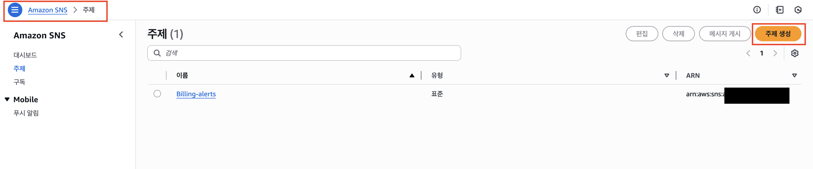

-> `표쥰`을 선택합니다.
-> `이름`을 기입합니다.
-> 나머지는 Default로 두고 생성합니다.

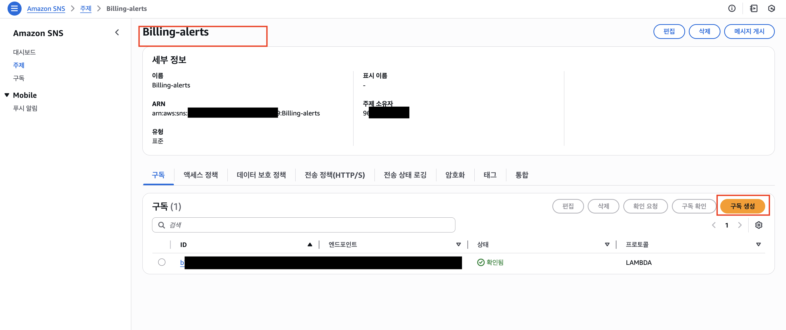
-> 생성된 주제를 클릭하여 해당 화면을 확인합니다.
-> `구독 생성` 버튼을 클릭하여 구독 생성화면으로 넘어갑니다.

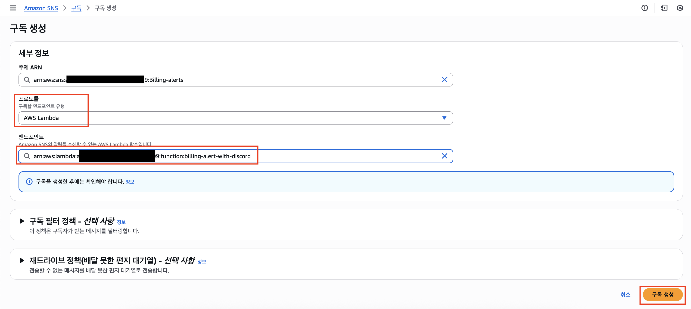
-> 프로토콜에서 `AWS Lambda`를 선택하고, 위에서 만든 람다를 선택합니다.

=> `구독 생성` 버튼을 클릭하여 구독을 생성합니다.

### 3. 예산 생성
사진을 참고해 예산을 생성합니다.

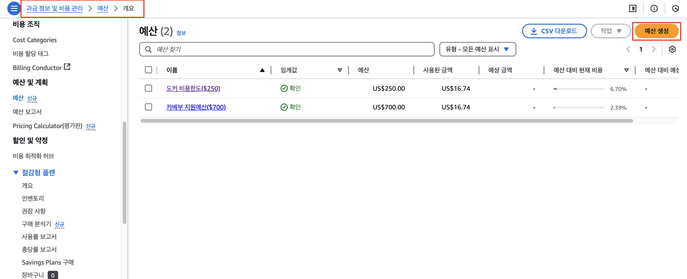
-> `예산 생성` 버튼을 클릭합니다.

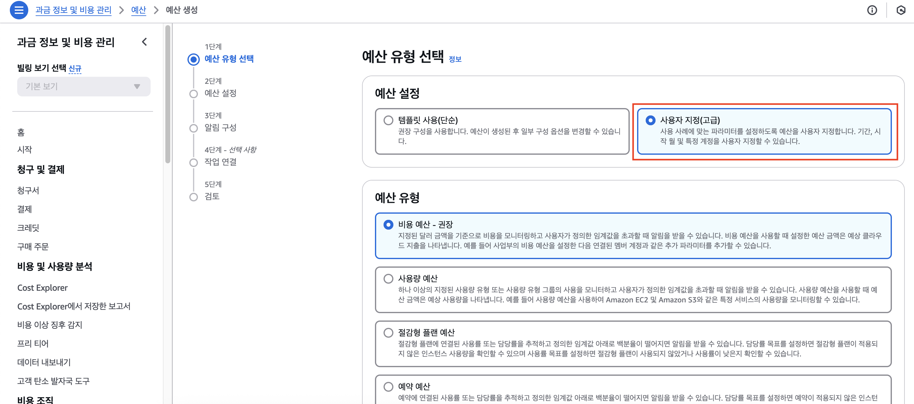

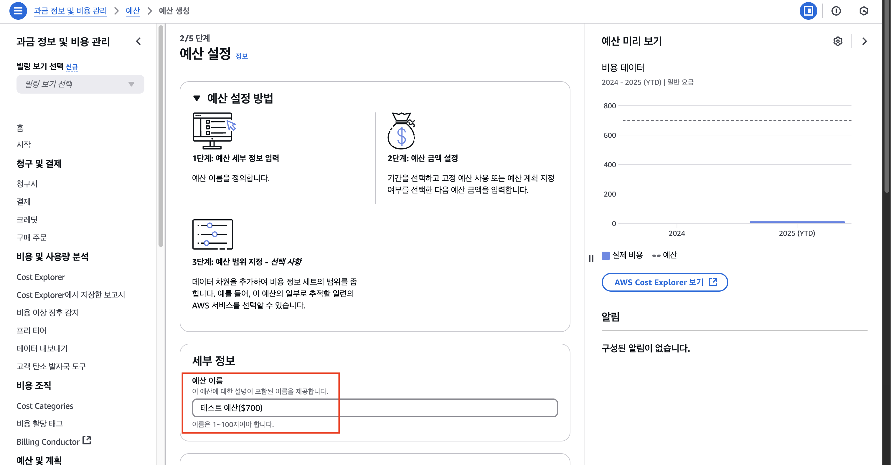

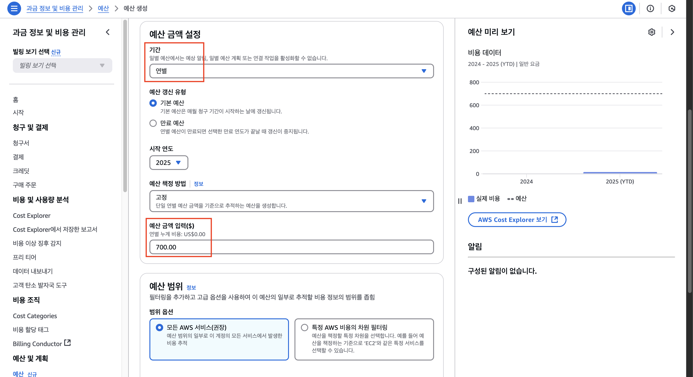

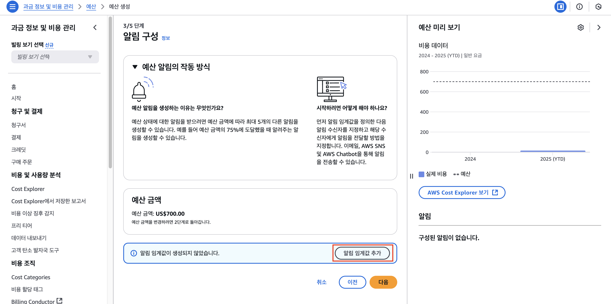

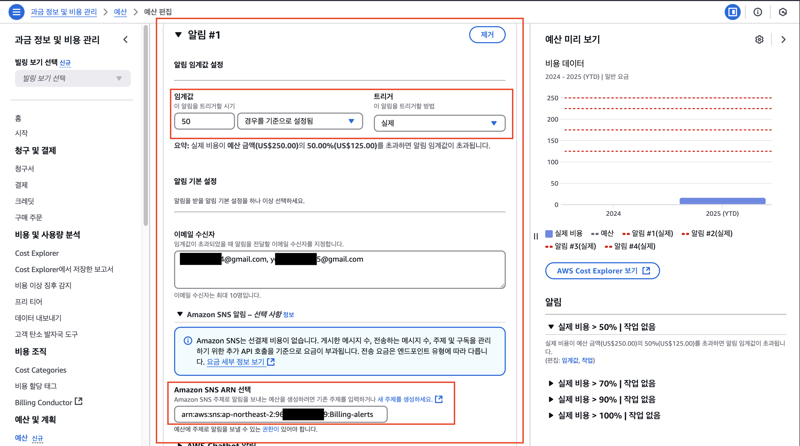
-> 위에서 만든 SNS 주제의 arn을 붙여넣습니다.

## 참고사항

- 순차적으로 설정하는 것이 좋습니다.

- 작동방식은 `예산(알림 트리거) -> SNS -> 구독 -> 람다` 입니다.

- 알림으로 설정한 예산 초과 시, 메일은 오지만 Lambda를 실행하지 못할 때는 `SNS <-> Lamdba` 간의 권한 문제일 수도 있습니다.

## 문의

문의는 Issues를 통해 부탁드립니다.
