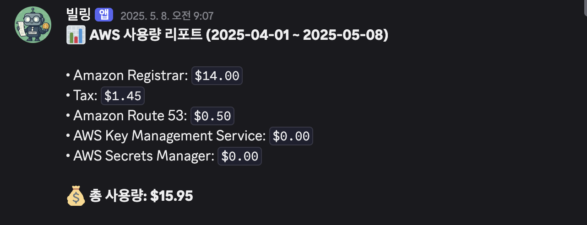
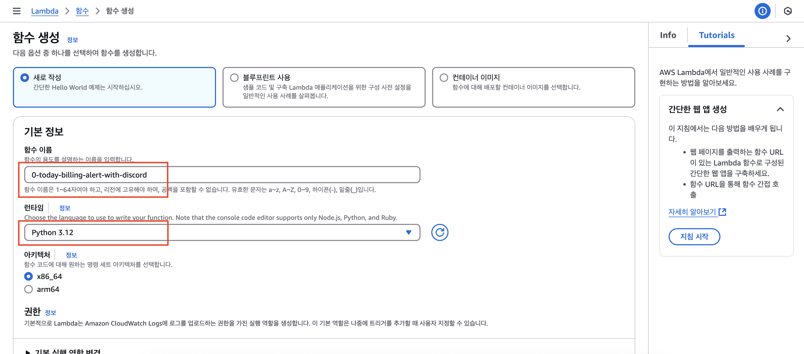
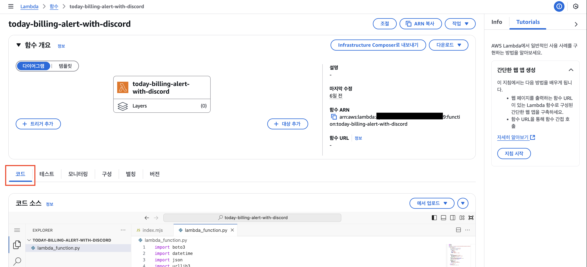
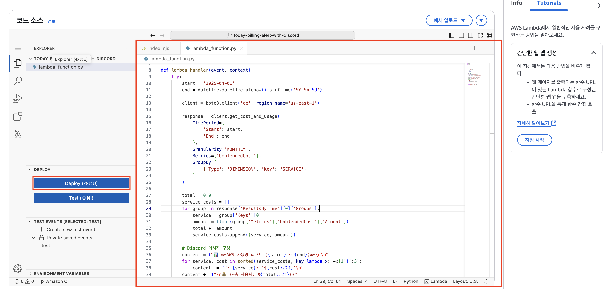
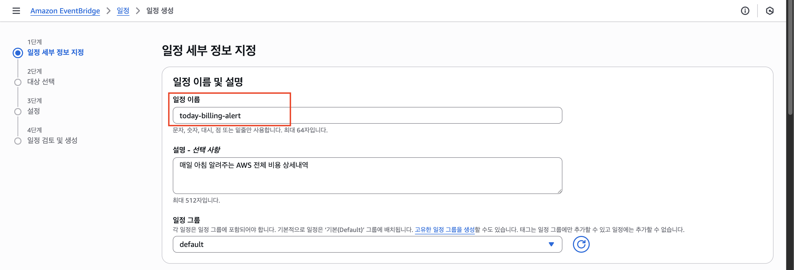
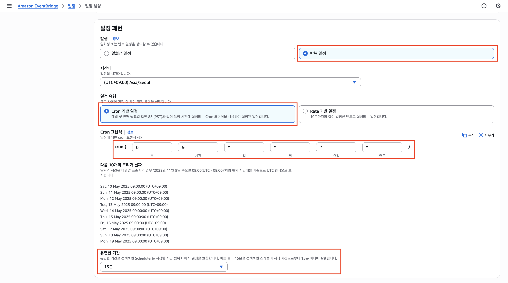
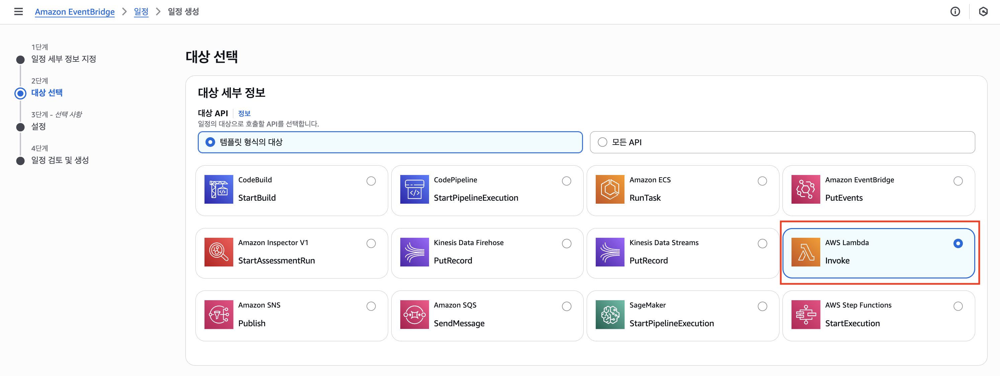
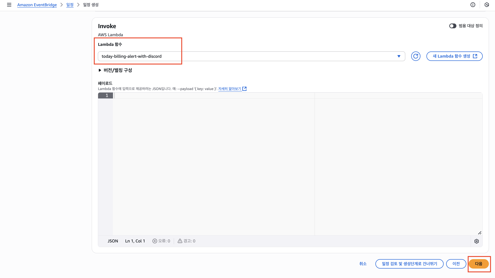
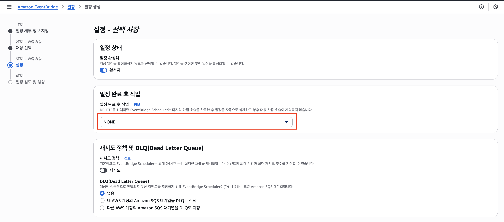
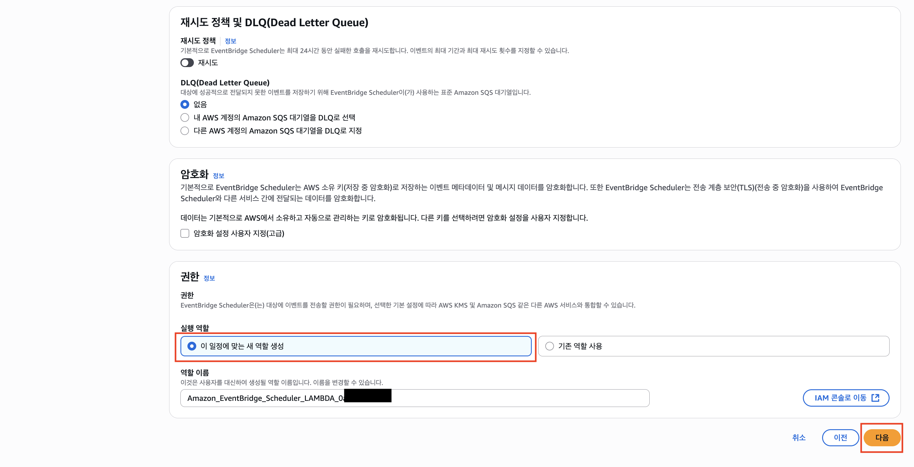

# 디스코드 봇 AWS 비용 상세내역 알림

### 📌 주요기능 

✅ 일일 비용 알림 (매일 오전 09:00~09:15)

: 현재까지의 사용된 비용의 상세내역을 매일 정해진 시간에 자동 전송해줍니다.

---

## 준비

#### 1. 디스코드 채널에서 웹훅을 만들어 URL을 복사합니다.

#### 2. 복사한 URL을 `lambda_function.py` 파일 내의 `DISCORD_WEBHOOK_URL = "디스코드_웹훅_URL"` 값에 붙여넣습니다.

## 사용방법
### 1. Lambda 함수 생성
사진을 참고해 `Lambda > 함수`를 생성합니다.

-> `함수 이름`: today-billing-alert-with-discord 
-> `런타임`: Python 3.12 
=> 나머지는 Default로 두고 생성합니다. 
=> 실제로는 `today-billing-alert-with-discord` 이름으로 생성하였습니다.

-> 생성이 완료되면 만든 함수를 클릭합니다.

-> 해당 화면을 확인하고, 코드 탭을 선택합니다.

-> `lambda_function.py`에 소스코드를 붙여넣습니다.
-> Deploy 버튼을 통해 배포를 합니다.

### 2. Amazon EventBridge의 일정 생성
사진을 참고해 `Amazon EventBridge > 일정`을 생성합니다.

-> Cron 표현식으로 알림을 받을 시간을 정합니다.

-> `AWS Lambda`를 선택합니다.

-> 앞에서 만든 Lamdba 함수를 선택합니다.  
-> 페이로드는 비워둡니다.

-> 일정 완료 후 작업을 `NONE`으로 설정합니다.

-> 나머지는 모두 Default 상태로 둡니다. 

=> 다음 버튼을 눌러 설정을 확인하고, 이상이 없다면 `일정 생성` 버튼을 클릭합니다.

## 참고사항

- 테스트는 임의로 일정 시간을 변경하거나 다음 날 9시까지 기다리셔야 합니다.

## 문의

문의는 Issues를 통해 부탁드립니다.
